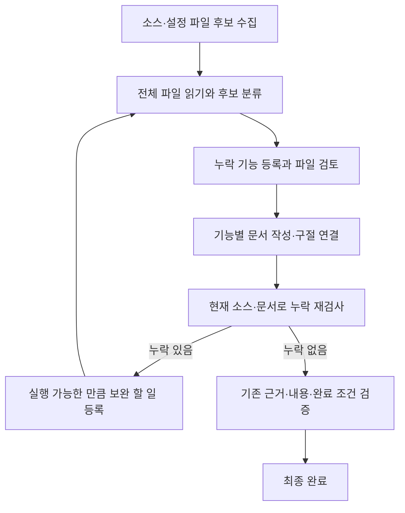

# 화면·서버 공통 기능 목록과 문서 검사

## 목적과 완료 기준

`capability_inventory`는 요청 범위의 기능 목록이고, `task_plan`은 다음에 실행할 작업의 순서입니다. 기능 수와 할 일 수를 분리해, 큰 기능을 하나의 할 일로 억지로 묶지 않습니다. `documentation_coverage`는 기능과 실제 Markdown 설명 사이의 누락을 검사합니다. 두 도구는 기본 도구이며 별도 활성화가 필요하지 않습니다. 일반 작업의 컨텍스트를 줄이기 위해 수집 시작 전에는 `scan`만 모델에 제공하고, 시작 후 전체 관리 기능과 문서 검사 도구를 노출합니다.



후보가 0개라는 이유로 파일이 검토 완료되지는 않습니다. 정규식이나 파일 경로 규칙으로 발견하지 못하는 동적 등록, 설정에 따른 화면, 라이브러리 내부의 진입점은 직접 읽고 등록해야 합니다. 알려지지 않은 소스 확장자도 파일 검토 대상으로 유지합니다.

## 1. 수집과 분류

먼저 `capability_inventory`에 `{"action":"scan"}`을 호출합니다. 한 번에 20개 파일을 처리합니다. 응답의 `summary.next_cursor`가 있으면 `{"action":"scan","cursor":"응답의 커서"}`로 계속합니다. 마지막 페이지에서 `scan_complete=true`가 됩니다. 전체 스캔을 다시 호출하면 변경 파일을 재분석하고, 변경되지 않은 파일의 분류·검토·문서 연결을 보존합니다.

파일/기능을 조회합니다.

```json
{"action":"list","view":"files","offset":0,"limit":10}
```

`view=features`가 기본값입니다. `next_offset`으로 다음 페이지를 읽을 때 이전 응답의 `revision`을 `expected_revision`으로 전달합니다. 조회 결과에는 현재 존재하지 않는 기능 기록도 `present=false`로 남습니다. 자동 후보는 `candidate`, 문서 대상은 `included`, 근거를 남긴 제외 항목은 `excluded`입니다.

소스를 읽고 후보를 분류합니다. 아래의 ID·버전 값은 예시이며 반드시 실제 응답 값을 사용합니다.

```json
{"action":"classify","expected_revision":1,"id":"F1","decision":"include","kind":"http","title":"계정 조회 API"}
```

지원 종류는 `screen`, `tab`, `dialog`, `http`, `rpc`, `websocket`, `event`, `job`, `cli`, `lifecycle`, `shared`입니다. `decision=exclude`는 `reason`이 필수이며 오탐 또는 원래 요청의 범위 밖이라는 근거를 적습니다. 구현 세부 함수마다 독립 기능을 만들 필요는 없습니다. 요청 범위에 따른 사용자 기능·서버 진입점·공통 동작을 구분합니다.

기본 탐색 규칙은 JSX Route/화면·탭 분기/대화상자, 페이지 파일 경로, 라우터 등록과 일부 HTTP 어노테이션, proto RPC, WebSocket 타입, 이벤트 구독, 스케줄 등록, CLI와 종료 훅 등의 **후보**를 찾습니다. 프레임워크별 완전한 라우팅 해석기는 아닙니다.

## 2. 수동 등록과 파일 검토

탐색이 놓친 기능은 `register`로 등록합니다.

```json
{"action":"register","expected_revision":2,"title":"설정으로 등록되는 정산 작업","kind":"job","path":"src/jobs.rs","start_line":10,"end_line":35,"expected_hash":"현재 소스 해시"}
```

소스 범위는 1~200줄이며 파일은 수집 목록 안에 있어야 합니다. 변경된 수동 기능은 기존 `id`를 함께 전달해 같은 ID의 위치·해시를 갱신합니다. 새 등록에서 같은 소스 구절·종류·제목을 사용하면 같은 기능을 재사용합니다. 하나의 동적 등록 코드에서 여러 기능을 제공할 때는 기능별 제목을 구분해 같은 범위에 여러 개를 등록할 수 있습니다. 하나의 자동 후보 안에 여러 HTTP 메서드나 화면 상태가 있으면 요청 범위에 맞게 각각 등록합니다. 없어진 수동 기능은 재스캔 후 근거를 남겨 제외할 수 있습니다.

파일의 모든 줄을 실제 `file_read`/줄 단위 읽기로 전달받은 후 다음처럼 검토합니다. 줄이 누락되면 첫 미독 줄을 안내하므로 그 위치부터 이어 읽습니다. 모든 후보를 먼저 분류하고 빠진 기능도 등록해야 합니다.

```json
{"action":"review_file","expected_revision":3,"path":"src/jobs.rs","expected_hash":"현재 소스 해시","source_ids":["S123"],"note":"스케줄 설정과 등록 함수를 대조했고 요청 범위의 작업을 모두 목록에 반영했습니다."}
```

`source_ids`는 이 파일의 현재 버전에서 완전히 전달된 읽기의 ID 1~32개입니다. 전체 읽기 범위는 누적 기록으로 검사하므로 모든 페이지 ID를 나열할 필요는 없습니다. 빈 파일은 `source_ids=[]`를 허용합니다. 읽기 완료는 내용 이해의 증명이 아니며 `note`에는 실제 확인 범위를 기록해야 합니다.

## 3. 문서 연결

문서는 별도의 `.md` 파일이어야 합니다. `document_inspect`에서 얻은 정확한 `section_path`와 현재 문서 해시를 사용합니다. 아래의 모든 필드에는 해당 섹션 안에 실제로 존재하는 12~1,000자 설명 구절을 전달합니다.

```json
{
  "action":"bind", "expected_revision":4, "id":"F1",
  "path":"docs/source-summary.md", "section":"# 기능 명세\n## 계정 조회 API",
  "expected_hash":"현재 문서 해시",
  "fields":{
    "purpose":"계정 조회 API는 요청된 계정의 기본 정보를 반환합니다.",
    "trigger":"GET /accounts/{id} 요청을 받으면 계정 조회를 실행합니다.",
    "inputs":"입력은 경로의 계정 식별자와 인증 토큰입니다.",
    "outputs":"출력은 계정 식별자와 표시 이름을 포함하는 JSON입니다.",
    "behavior":"인증 후 계정을 조회하고 응답 스키마에 맞게 변환합니다.",
    "data_changes":"조회 기능이므로 저장된 계정 데이터는 변경하지 않습니다.",
    "errors":"계정이 없으면 404 오류 응답을 반환합니다.",
    "permissions":"요청 계정에 대한 조회 권한이 필요합니다."
  }
}
```

예시는 계약 설명용입니다. 실제 동작·오류·권한은 해당 소스의 근거로 작성해야 합니다. 해당하지 않는 필드도 문서에 이유를 적고 그 구절을 인용합니다. 제목만으로는 연결이 승인되지 않습니다. 같은 섹션의 다른 설명이 추가되어도 연결한 구절이 온전하면 유지되며, 소스 변경·설명 삭제·섹션 이동으로 연결이 깨지면 다시 연결해야 합니다.

## 4. 누락 점검과 보완

`documentation_coverage`에 `{"action":"audit"}`를 호출합니다. `ready`는 파일 수집·전체 읽기 후 검토·후보 분류·문서 구절 연결의 구조 검사 결과입니다. `semantic_verified=false`이므로 내용의 진실성을 뜻하지 않습니다. 제외 사유가 원래 요청에 맞는지와 문서 내용은 기존 검증에서 별도로 확인합니다.

문제 목록도 기본 10개, 최대 20개씩 반환됩니다. `next_offset`을 사용할 때 `expected_fingerprint`에 직전 `fingerprint`를 전달합니다. 검사 중 대상이 바뀌면 페이지 처음부터 다시 확인하도록 안내합니다. 아주 작은 응답 예산에서는 전체 결과를 `history`에 보관하고 조회 커서를 제공합니다.

```json
{"action":"enqueue","expected_fingerprint":"직전 검사 지문"}
```

수집·분류·검토·문서 보완을 기존 할 일 뒤에 넣고, 이미 대기 중인 동일 작업은 중복 등록하지 않습니다. 완료했던 같은 작업이 다시 필요하면 재개합니다. 100개 한도나 상태 토큰 예산에 도달하면 현재 등록분을 실행하고, 해결되지 않은 나머지는 다음 점검에서 등록합니다. 검증 단계에서도 현재 포함된 기능의 **정확한 제목**을 사용한 새 `investigation upsert`는 누락 보완으로 허용합니다.

활성화된 목록은 최종 응답 직전에 현재 파일 집합·소스 해시·문서 구절로 다시 검사합니다. 할 일만 완료 표시하거나 최종 응답을 반복해도 검사 결과는 바뀌지 않습니다. 동일한 실제 누락으로 종료 시도가 8회 재발하면 부분 결과와 보완 목록을 보존합니다. 재개하면 이어서 처리하며 성공으로 표시하지 않습니다. 일반 실행 시간·토큰·취소·도구 시간 제한도 계속 적용됩니다.

## 범위와 제한

- 소스·설정 파일 최대 10,000개, 보존 기능 최대 5,000개입니다. 조사 범위를 넘는 결과를 조용히 버리지 않고 오류를 반환합니다.
- 목록 메타데이터는 세션 `memory_bytes`의 절반 이내로 제한합니다. 문서 구절·검토 메모를 간결하게 유지해야 합니다. 나머지 세션 메타데이터 예산도 별도로 적용됩니다.
- 프로젝트 include/exclude, ignore 규칙, 공통 빌드·의존성 폴더 제외 규칙을 따릅니다. Markdown 문서, 정적 이미지·미디어, 잠금 파일, OS 메타데이터 파일 등은 자동 수집에서 제외됩니다. MDX 및 pages/routes 안의 Markdown은 소스에 포함합니다. 페이지 폴더의 Markdown·Astro·HTML도 화면 후보로 탐색합니다. 심볼릭 링크는 따라가지 않습니다.
- 진행 중 프로젝트 범위를 바꾸어 미작성 기능을 숨길 수 없습니다. 기존 범위를 복원하거나 사용자가 새 요청으로 범위를 다시 정해야 합니다.
- 삭제된 자동 후보는 기록을 보존하고 현재 목록에서 제외합니다. 변경된 수동 기능은 재등록 또는 명시적 제외가 필요합니다.
- `applied=false`는 인자·버전·용량 등 복구 가능한 거절입니다. 목록은 원자적으로 보존되고 실패 호출 ID를 성공으로 캐시하지 않습니다. 안내에 맞춰 수정하고 다시 호출합니다.
- `계속`/resume과 체크포인트는 목록을 보존하고, 별도의 새 사용자 요청은 목록을 초기화합니다. 목록은 기존 세션과 같이 프로세스 메모리에 보관되며 앱 재시작 후 영구 복원을 추가하는 기능은 아닙니다.
- 런타임 전용 등록, 외부 서비스 설정, 소스 범위 밖 플러그인의 전체 기능은 정적 탐색만으로 보장할 수 없습니다. 관련 근거를 확보해 수동 등록하고, 확보하지 못한 범위는 원래 완료 조건에서 미확인으로 남겨야 합니다.
