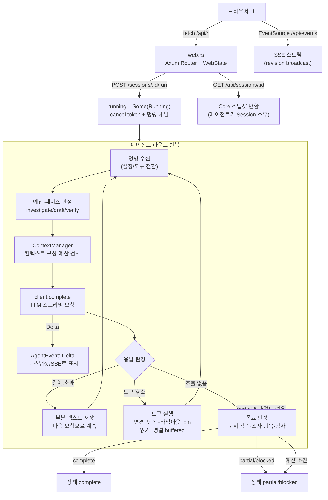
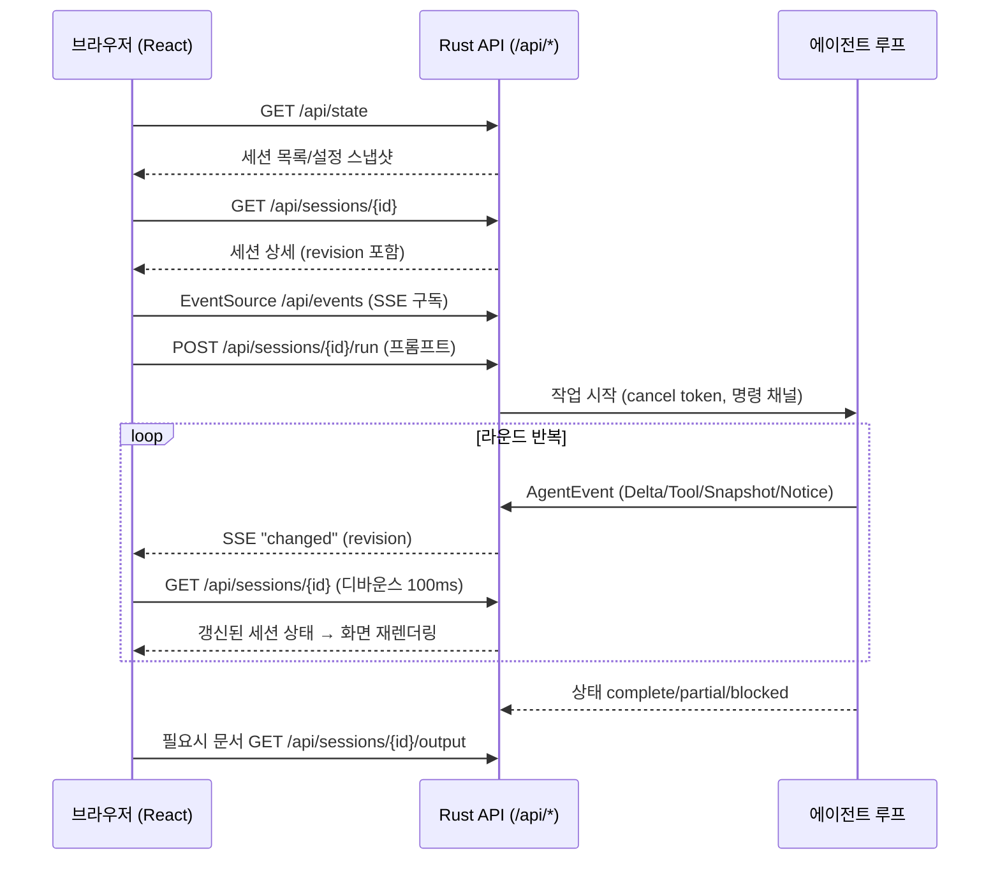

# MnemoArc 프로젝트 요약·구조·주요 실행흐름

## 프로젝트 개요

MnemoArc는 세션 안에서 기억을 저장·검색·재사용하며, 소스 코드를 조사해 근거 있는 Markdown 문서를 만드는 에이전트입니다. **React 브라우저 UI(Node.js/Vite) + Rust 실행부**로 구성되며, 기존 터미널 UI는 브라우저 화면으로 교체되었습니다 (README.md 1–3행).

실행 방식은 `src/main.rs:41-94`의 CLI 서브커맨드로 정리됩니다.

- `web` (기본값): React UI와 로컬 에이전트 API 서버를 실행 (`mnemoarc::web::serve_managed`, src/main.rs:64-73)
- `check`: 일반 응답·스트리밍·도구 호출 라운드트립 검증 (`llm::OpenAiClient.probe`, src/main.rs:76-77)
- `evaluate`: 고정 소스 문서화 케이스를 전체/제한 기억 재사용으로 반복 평가 (`evaluation::run`, src/main.rs:78-82)
- `run`: 터미널 UI 없이 동일 에이전트를 headless 실행 (`agent::headless`, src/main.rs:83-92). 상태가 `blocked`/`partial`이면 종료 코드 2

설정은 기본값 → `.env`/프로세스 `MNEMOARC_*` → 저장된 TOML → 세션 임시 설정 우선순위를 따르며(README.md), API 키는 앱 실행 중에만 보관하거나 `config.credentials.json`(권한 0600)에 저장할 수 있습니다.

## 프로젝트 구조

| 경로 | 역할 |
|---|---|
| `src/lib.rs` | 루트 모듈 선언: `agent, config, context, evaluation, llm, memory, session, tools, web` (src/lib.rs:1-9) |
| `src/main.rs` | clap 기반 CLI 진입점 (`web`/`config`/`check`/`evaluate`/`run`) |
| `src/web.rs` | Axum 기반 로컬 브라우저 API. 실행 중 에이전트가 Session을 소유하고 웹 계층은 표시용 스냅샷만 보유 (src/web.rs:1) |
| `src/agent.rs` | 에이전트 실행 루프, LLM 요청/응답 처리, 도구 병렬 실행, 이벤트(`AgentEvent`) 발행 |
| `src/session.rs` | 세션 상태(대화 번들, 기억, 조사 항목 등) 보관 |
| `src/context.rs` | 컨텍스트 예산 관리(`ContextManager::request/prepare`)와 토큰 추정 |
| `src/llm.rs` | OpenAI 호환 클라이언트(`OpenAiClient`), 스트리밍/도구 호출 |
| `src/tools.rs`, `src/tools/documentation.rs` | 도구 레지스트리와 문서 편집/감사 도구 |
| `src/memory.rs` | 세션 로컬 기억 저장소 |
| `frontend/` | React UI. `App.jsx`(상태·갱신), `api.js`(fetch 클라이언트), `Chat.jsx`, `Settings.jsx`, `src/chat/*`(Markdown·수식·Mermaid 렌더링) |
| `scripts/dev.mjs` | `npm run dev`로 Rust API + Vite 개발 서버 동시 실행 |
| `start_all.sh/.bat` | 의존성 설치·빌드 후 API(3030)/프론트엔드(5173) 백그라운드 실행 |
| `tests/` | `agent.rs`, `core.rs`, `documentation.rs`, `streaming.rs`, `web.rs` 등 통합 테스트 |
| `eval/` | 평가 스위트와 mini-service 픽스처 |

## 백엔드(Rust) 동작 로직

### HTTP API 계층 (src/web.rs)

`WebState`는 `Arc<Mutex<Core>>`(세션 맵, 실행 중 작업 `running`, 리비전, 자격 증명), `broadcast::Sender<u64>` 이벤트, LLM 클라이언트를 보유합니다 (src/web.rs:50-59). 상태가 바뀌면 `changed()`가 리비전을 올리고 브로드캐스트합니다 (src/web.rs:78-81).

주요 라우트 (src/web.rs:206-219):

- `GET /api/state` — 전체 상태 스냅샷
- `GET /api/events` — SSE 이벤트 스트림 (src/web.rs:225)
- `PUT /api/settings`, `POST /api/check`, `GET /api/directories`
- `POST /api/sessions`, `GET/DELETE /api/sessions/{id}`
- `POST /api/sessions/{id}/run`, `POST /api/sessions/{id}/cancel`
- `PUT /api/sessions/{id}/settings|project|tools`, `GET .../memories/{memory}`, `GET .../output`

동시 실행 규칙: `Core.running`이 이미 있으면 `busy()`(409, "다른 작업이 실행 중입니다")를 반환합니다 (src/web.rs:69-76). 세션 종료 시에는 진행 중인 쓰기의 결과를 회수한 뒤(`closing` 처리) RAM 상태를 폐기합니다. API 키 파일은 임시 파일에 쓰고 `0o600` 권한으로 persist합니다 (src/web.rs:88-107).

### 에이전트 실행 루프 (src/agent.rs)

`run_session_controlled`가 중심 루프입니다 (src/agent.rs:143-…).

1. **명령 수신**: `RunCommand::Configure/Tools`를 요청 경계에서 적용합니다. 설정 적용 실패 시 "Settings pending cleanup" 공지와 함께 이전 설정을 유지합니다 (src/agent.rs:167-191).
2. **예산·페이즈 판정**: 실행 시간/토큰 예산을 초과하면 `run_budget_exhausted`로 중단합니다. 남은 예산 비율에 따라 페이즈를 `investigate → draft → verify`로 전환하고, `finalization_attempts > 0`이면 항상 `verify`로 되돌립니다 (src/agent.rs:194-235). 각 라운드마다 `run_guidance`에 페이즈 지침을 담아 모델에 전달합니다 (src/agent.rs:238-241).
3. **컨텍스트 준비**: `ContextManager::request/prepare`로 요청을 구성하고, 요청 토큰 + 출력 토큰 + 512 마진이 `context_tokens`를 넘거나 남은 실행 예산을 넘으면 원본 컨텍스트를 유지한 채 실패 처리합니다 (src/agent.rs:248-309).
4. **LLM 호출**: `client.complete(...)`를 타임아웃·취소와 함께 `tokio::select!`로 실행하고, 스트리밍 델타를 `AgentEvent::Delta`로 릴레이합니다 (src/agent.rs:310-335). 사용량이 없으면 토큰을 추산하고 `usage_incomplete`를 표시합니다.
5. **길이 초과 복구**: 응답이 출력 한도에 걸리면 부분 텍스트를 히스토리에 저장하고 다음 요청으로 이어갑니다(`continues_previous`). 문서 작업은 연속 8회 이후에도 작은 완전한 편집 호출로 복구하며, 문서 외 작업만 `length_recovery_limit`으로 중단합니다. 실제 문맥·실행 토큰·시간 제한은 계속 적용합니다 ([최신 점검](document-completion-loop-audit-2026-09-24.md)).
6. **도구 호출 실행**: 배치 한도(최대 32개)를 초과하면 실패합니다 (src/agent.rs:392-397). 호출이 없으면 종료 판정을 합니다 — `verify_document_write`, `require_investigation` 조사 항목 검증, `audit_document` 구조 감사를 통과해야 `complete`이고, 실패 시 `partial` + `finalization_attempts` 카운트 후 검증 페이즈로 복귀합니다 (src/agent.rs:418-449).
7. **도구 실행 상세**: 단일 변경 도구는 `spawn_blocking` + 타임아웃으로 실행하며, 취소 후에도 완료된 쓰기를 반드시 join해 회수합니다 (src/agent.rs:42-67). 읽기 병렬 호출은 `buffered(read_parallelism)`로 실행하고 각 결과의 소스·파일 커서를 소유 세션에 병합하며, 잘린 결과는 히스토리 아카이브 ID를 소유 세션 번들로 치환합니다 (src/agent.rs:69-127).

### 백엔드 흐름 다이어그램

## 프론트엔드(React) 동작 로직

### 데이터 흐름 (frontend/src/App.jsx, api.js)

- `api.js`의 `api()`는 `/api` 접두사로 fetch를 감싸고, 실패 응답의 `error` 메시지를 그대로 throw합니다 (frontend/src/api.js:1-16). `statusLabel`은 세션 상태를 한국어 라벨로, `toolLabels`는 도구 이름을 표시명으로 매핑합니다 (frontend/src/api.js:19-47).
- `App.jsx`는 `refresh()`에서 `GET /api/state` → 세션 목록 동기화 → 선택 세션 `GET /api/sessions/{id}`를 수행합니다. 리비전이 뷰의 버전보다 새로울 때만 갱신하며, 이전에 명시적으로 불러온 오래된 번들을 유지합니다 (frontend/src/App.jsx:24-76).
- 갱신 트리거는 세 가지입니다: `EventSource("/api/events")`의 `changed` 이벤트(100ms 디바운스), 3초 폴링 백업, 액션 후 수동 refresh (frontend/src/App.jsx:78-97). 세션 선택은 URL 해시에 저장됩니다 (`choose`, frontend/src/App.jsx:99-108).
- `act(fn)` 헬퍼는 작업 실행 → 오류 표시 → refresh 순으로 처리합니다.

### 렌더링

`Chat.jsx`/`chat/Message.jsx`가 메시지를 렌더링하고, `src/chat/`의 remark 플러그인(표, 수식 보존, GFM), `Mermaid.jsx`, `Chart.jsx`가 Markdown·수식·Mermaid·차트 렌더링을 담당합니다. 이 렌더링 코드는 외부 `llm_agent/frontend`에서 재사용했으며 범위는 `frontend/REUSE.md`에 기록되어 있습니다 (README.md).

### 프론트엔드 흐름 다이어그램

## 오류 처리 요약

- **동시 실행 충돌**: 두 번째 실행 요청은 409 CONFLICT (src/web.rs:69-76).
- **예산 초과**: 실행 시간/토큰 예산 초과 시 `run_budget_exhausted`, 부분 결과와 기억은 보존 (src/agent.rs:194-200).
- **컨텍스트 한도**: 입력 추정 + 출력 + 512 마진이 한도를 넘으면 원본 컨텍스트 유지 후 실패 (src/agent.rs:289-309).
- **길이 초과 응답**: 문서 외 작업은 8회 연속 발생 시 `length_recovery_limit`. 문서 작업은 실제 문맥·실행 토큰·시간 안에서 호출 분할과 응답 축약으로 복구합니다 ([최신 점검](document-completion-loop-audit-2026-09-24.md)).
- **도구 타임아웃·취소**: 기한 초과 후에도 최종 결과를 회수해 쓰기 누수를 방지 (src/agent.rs:56-67).
- **문서 완료 검증**: 조사 항목 미검증·감사 이슈 잔존 시 `partial`로 되돌려 검증 재개 (src/agent.rs:418-449).
- **headless 실행**: `partial`/`blocked` 종료는 종료 코드 2 (src/main.rs:89-93).

## 미확인 사항

- `session.rs`, `memory.rs`, `context.rs`의 내부 구조(세션 저장 형식, 기억 키 규칙, 컨텍스트 압축 알고리즘)는 이번 범위에서 개별 문서화하지 않았습니다.
- `evaluation.rs`의 평가 스위트 상세(케이스 형식, 채점 방식)는 `eval/suite.toml` 확인이 필요합니다.
- SSE `events` 핸들러의 세부 이벤트 형식(`changed` 페이로드)은 src/web.rs:225 부분까지만 확인했습니다.
