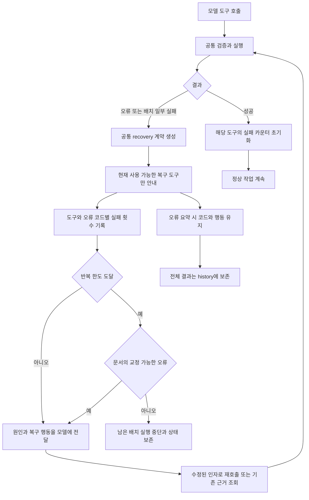

# 모든 도구에 적용되는 오류·복구 계약

개별 프롬프트에만 의존하지 않고, 도구의 공통 실행 경계에서 오류를 분류하고 복구 행동을 전달한다. 오류를 완전히 없애는 설계가 아니라 잘못된 요청이 성공으로 통과하거나, 원인 없이 반복되거나, 결과를 잃는 것을 제한하는 설계다.



## 결과 계약

실패 결과는 기존 `status`와 `error`를 유지하며 다음 `recovery` 객체를 함께 반환한다.

```json
{
  "code": "unknown_source",
  "class": "missing_evidence",
  "action": "lookup_observed_evidence",
  "automatic_retry": false,
  "tools": ["source_lookup", "history"]
}
```

- `code`: 오류의 안정적인 식별자. 기존 문자열 오류를 공통 계층에서 분류하며, 식별 불가능한 오류는 `tool_error`로 보수적으로 처리한다.
- `class`: 입력 오류, 근거 누락, 상태 변경, 용량, 도구 사용 불가, 배치 일부 실패, 취소, 일시적 오류, 결과 불확실, 미분류.
- `action`: 인자 수정, 관측된 근거 조회, 상태 재조회, 정리, 실패 항목만 수정 등 권장 복구 행동.
- `tools`: 현재 모델에게 실제 제공되는 도구와 교집합으로 제한한다. 체크포인트에서 금지된 파일 읽기나 기억 재사용 비활성 상태의 memory_read를 안내하지 않는다. 작은 결과 예산에서는 이 목록을 생략하되 코드와 행동은 유지한다.
- `automatic_retry`: 현재 모든 경우 false. 쓰기를 자동 반복하거나 잘못된 source ID를 임의 대체하지 않는다. 모델이 결과를 보고 수정한 호출을 해야 한다.

## 적용 범위

- 모든 등록 도구의 `run_call_cancellable` 경계를 사용한다. 새 도구도 별도 분기 없이 공통 실패 계약을 적용받는다.
- 에이전트가 생성한 타임아웃·취소·워커 실패에도 같은 계약을 적용한다. 병렬 읽기 결과도 소유 세션에서 동일하게 처리한다.
- 배치의 표준 `data.results[].result.status` 또는 `data.results[].status`에 실패가 있으면 바깥 결과도 오류로 표시한다. 기존 성공 항목을 되돌리거나 버리지 않는다. 이런 결과는 성공 ledger에 캐시하지 않는다.
- 잘못된 JSON과 최상위 인자 형식은 실행 전에 거부한다. 기존 도구별 출처·해시·수정 조건 검사는 유지한다.
- `stall_round_limit`을 도구와 오류 코드 단위로 적용한다. 인자나 호출 ID를 바꾸어도 같은 오류의 카운터는 누적된다. 해당 도구의 성공만 카운터를 초기화한다. 무관한 문서 쓰기나 task_state 성공으로 실패 횟수를 지울 수 없다.
- 문서 작업의 입력·선행조건·경로·근거·상태·용량·일부 실패는 횟수가 누적되면 원인을 표시하고 수정 동작으로 돌아간다. 자동으로 같은 쓰기를 재실행하지 않으며, 남은 실행 예산으로 모델이 원인을 교정하도록 한다. 결과 불확실·실행 불가·미분류 오류와 문서 외 작업은 기존 중단 기준을 유지한다. 중단 기준에 도달한 경우 아직 시작하지 않은 배치 호출은 실행하지 않는다. 이미 실행한 읽기·쓰기 결과는 유지한다. 비활성 도구 선택, 지원하지 않는 언어의 텍스트 읽기 전환, 진행 중 체크포인트 완료로 해결할 수 있는 오류도 문서 복구 대상이다. 문서 체크포인트는 횟수만으로 종료하지 않고 실제 컨텍스트 및 실행 예산 안에서 계속한다. 문서 외 체크포인트의 기존 요청·실패 횟수 제한은 유지한다.
- 문서 작업의 도구 호출 수 초과는 실행하지 않은 배치임을 명시하고 `run_guidance.max_tool_calls` 이내로 분할해 재요청하도록 한다. 결과 예산으로 계산한 호출 수와 공급자 응답의 최대 32개 검사 모두 적용하며, 거절된 배치의 일부 쓰기를 먼저 실행하지 않는다.
- 공급자 응답 파서에서 거절된 `invalid_tool_arguments`·`malformed_tool_call`도 실행되지 않은 배치로 처리한다. 문서 작업은 완전한 JSON 객체, 짧고 고유한 호출 ID, 실제 제공되는 도구 이름으로 교정하여 계속한다. 검토 전용 요청에서는 도구 재호출 대신 검토 JSON 교정을 안내한다. 사용량을 얻지 못한 파싱 실패는 시도별 입력 추정량과 예약 출력량을 실행 예산에 반영한다. 존재하지 않는 도구 이름(`unsupported_tool`)도 목록에서 올바른 이름을 선택할 수 있으므로 문서 작업을 횟수로 중단하지 않는다.
- 카운터는 한 run 안에서 유지한다. 명시적 재개는 새 복구 예산을 부여한다.

### 할 일 목록의 입력 복구

`task_plan.operations`는 공통 배열 검사 대신 전용 파서에서 검증한다. 엄격한 JSON으로 해석 가능한 문자열·단일 작업 객체만 배열로 정규화하며, 작업 의미·ID·수행 결과를 추측하거나 채우지 않는다. 작업별 필수 필드와 버전·순서·용량 검사는 계속 적용한다.

해석할 수 없거나 적용 조건이 맞지 않는 목록 수정은 `status: ok`, `data.applied: false`로 반환한다. 이는 요청을 처리했으나 목록은 변경하지 않았다는 뜻이다. 이러한 결과는 반복 도구 오류나 체크포인트 실패로 세지 않고, 성공 캐시에도 넣지 않는다. 입력 오류에는 `input_error`로 기대 형식·실제 타입·수정 예시를 제공하며, 작은 결과 예산에서도 미적용 여부와 핵심 형식 안내를 보존한다. 목록을 만들지 못한 채 반복하는 경우도 실행부의 진행 정체 감지에는 포함된다.

## 검증과 한계

등록 도구 전체를 순회하며 잘못된 인자가 같은 복구 계약으로 거절되고 상태가 변경되지 않는지 검사한다. 별도로 체크포인트 복구 도구 필터, 배치 일부 실패, 작은 결과 예산, 미분류·패닉 처리, 비활성 기억 도구, 인자가 바뀌는 반복 오류와 한도 뒤 쓰기 차단을 검사한다.

이는 모든 도구의 모든 의미적 오류가 사전에 검출된다는 보장은 아니다. 기존 함수들은 아직 anyhow 문자열 오류를 사용하므로 알려지지 않은 오류는 자동 복구하지 않고 검사 대상으로 남긴다. 파일 시스템 쓰기 전체의 트랜잭션 롤백을 제공하지 않으며, 실패 전 완료된 쓰기를 지우거나 자동 재실행하지 않는다. 모델의 판단 정확성은 기존 근거 검증과 문서 검토를 함께 사용해 확인해야 한다.

## 문서 검증 도구 개선 (2026-09-21)

세션에서 발생한 반복 호출을 기준으로 다음 계약을 보강했다.

- `investigation verify_batch`는 `data.summary`에 전체·성공·실패 수와 `failures_by_code`(코드, 개수, 항목 ID)를 반환한다. `succeeded_ids`는 유지된 성공, `retry_ids`는 수정 후 재시도할 실패 항목이다. 실패 항목이 있어도 성공한 검증은 유지된다. 이후 해당 섹션·출처·기억이 바뀌면 기존 재검증 규칙이 적용된다.
- `verify`와 배치 내부 검증은 출처 조회보다 항목의 `written` 사전조건을 먼저 확인한다. 설명에도 문서 작성 → `upsert`로 섹션과 `written` 등록 → 검증 순서를 명시했다. `document_edit`가 이미 항목을 `written`으로 전환했다면 다시 등록할 필요는 없다.
- `source_coverage_missing`은 모든 인용에서 실제로 누락된 구간을 모아 `data.missing_ranges`에 `{path,start_line,end_line}` 배열로 반환한다. 이미 읽은 중간 구간을 제외하고 중복·겹침 구간을 합친다. 출처 최신성 검사는 그대로 유지한다. 결과 예산을 넘는 전체 내용은 기존 `history` 아카이브와 `next_cursor`로 조회한다.
- `upsert`로 `written`을 등록할 때 현재 문서에 섹션이 존재하는지 확인하고, 고유한 일반 제목을 완전한 Markdown 제목으로 정규화한다. 잘못되거나 모호한 제목은 기존 항목을 변경하지 않고 거절한다. 문서 작성 전 계획은 `in_progress` 등으로 등록할 수 있다. 이것은 작성 위치 확인이며 내용 검증이나 해시 충돌 보호를 대체하지 않는다.
- 조사 액션별 허용·필수 필드를 같은 계약에서 가져와 모델용 `oneOf` 스키마와 실행 전 검사에 사용한다. 배치 항목은 `source_ids`, `verification_note`만 받으며 잘못된 항목 때문에 정상 형제 항목을 버리지 않는다. `task_state`의 상태 필드는 `patch` 안에 넣도록 설명하고 잘못된 최상위 인자도 해당 위치로 안내한다.
- `memory_sources_required`는 기억 근거 복구로, `checkpoint_has_failed_operations`는 다음 모델 요청에서 선행 오류를 수정하는 복구로 분류한다. 자동 출처 승계나 자동 재시도로 근거 검사를 우회하지 않는다.

별도 프런트엔드 검증기는 추가하지 않았다. 모델이 생성하는 호출은 서버의 공통 검사 경계를 거치므로, 호출 전 모델에 전달되는 스키마와 상태 변경 전 검사에 계약을 모았다. 별도 인용 추출 도구 대신 검증 실패 자체에 전체 누락 구간을 반환해 동일 검증을 반복해야 하는 원인을 줄였다.

검증: `npm test` 통과(Rust 193개, 실행 스크립트 5개, 프런트엔드 4개; 기존 환경 의존 테스트 5개 제외). `cargo clippy --all-targets -- -D warnings`, `cargo fmt --check`, `git diff --check` 통과. 실제 모델 API를 호출하는 라이브 검증이나 실행 중인 서버 재시작은 수행하지 않았다.
