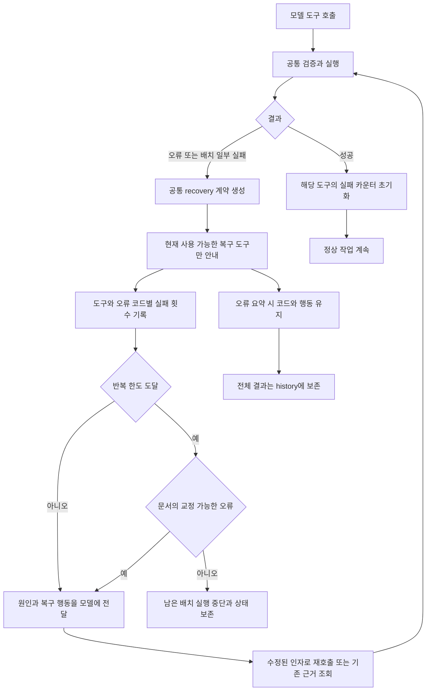

# 모든 도구에 적용되는 오류·복구 계약

개별 프롬프트에만 의존하지 않고, 도구의 공통 실행 경계에서 오류를 분류하고 복구 행동을 전달한다. 오류를 완전히 없애는 설계가 아니라 잘못된 요청이 성공으로 통과하거나, 원인 없이 반복되거나, 결과를 잃는 것을 제한하는 설계다.


```mermaid
flowchart TD
    A[모델 도구 호출] --> B[공통 검증과 실행]
    B --> C{결과}
    C -->|성공| D[해당 도구의 실패 카운터 초기화]
    C -->|오류 또는 배치 일부 실패| E[공통 recovery 계약 생성]
    E --> F[현재 사용 가능한 복구 도구만 안내]
    F --> G[도구와 오류 코드별 실패 횟수 기록]
    G --> H{반복 한도 도달}
    H -->|아니오| I[원인과 복구 행동을 모델에 전달]
    I --> J[수정된 인자로 재호출 또는 기존 근거 조회]
    J --> B
    H -->|예| O{문서의 교정 가능한 오류}
    O -->|예| I
    O -->|아니오| K[남은 배치 실행 중단과 상태 보존]
    D --> L[정상 작업 계속]
    F --> M[오류 요약 시 코드와 행동 유지]
    M --> N[전체 결과는 history에 보존]
```

## 결과 계약

실패 결과는 기존 `status`와 `error`를 유지하며 다음 `recovery` 객체를 함께 반환한다.

```json
{
  "code": "unknown_source",
  "class": "missing_evidence",
  "action": "lookup_observed_evidence",
  "automatic_retry": false,
  "tools": ["source_lookup", "history"]
}
```

- `code`: 오류의 안정적인 식별자. 기존 문자열 오류를 공통 계층에서 분류하며, 식별 불가능한 오류는 `tool_error`로 보수적으로 처리한다.
- `class`: 입력 오류, 근거 누락, 상태 변경, 용량, 도구 사용 불가, 배치 일부 실패, 취소, 일시적 오류, 결과 불확실, 미분류.
- `action`: 인자 수정, 관측된 근거 조회, 상태 재조회, 정리, 실패 항목만 수정 등 권장 복구 행동.
- `tools`: 현재 모델에게 실제 제공되는 도구와 교집합으로 제한한다. 체크포인트에서 금지된 파일 읽기나 기억 재사용 비활성 상태의 memory_read를 안내하지 않는다. 작은 결과 예산에서는 이 목록을 생략하되 코드와 행동은 유지한다.
- `automatic_retry`: 현재 모든 경우 false. 쓰기를 자동 반복하거나 잘못된 source ID를 임의 대체하지 않는다. 모델이 결과를 보고 수정한 호출을 해야 한다.

## 적용 범위

- 모든 등록 도구의 `run_call_cancellable` 경계를 사용한다. 새 도구도 별도 분기 없이 공통 실패 계약을 적용받는다.
- 에이전트가 생성한 타임아웃·취소·워커 실패에도 같은 계약을 적용한다. 병렬 읽기 결과도 소유 세션에서 동일하게 처리한다.
- 배치의 표준 `data.results[].result.status` 또는 `data.results[].status`에 실패가 있으면 바깥 결과도 오류로 표시한다. 기존 성공 항목을 되돌리거나 버리지 않는다. 이런 결과는 성공 ledger에 캐시하지 않는다.
- 잘못된 JSON과 최상위 인자 형식은 실행 전에 거부한다. 기존 도구별 출처·해시·수정 조건 검사는 유지한다.
- `stall_round_limit`을 도구와 오류 코드 단위로 적용한다. 인자나 호출 ID를 바꾸어도 같은 오류의 카운터는 누적된다. 해당 도구의 성공만 카운터를 초기화한다. 무관한 문서 쓰기나 task_state 성공으로 실패 횟수를 지울 수 없다.
- 문서 작업의 입력·선행조건·경로·근거·상태·용량·일부 실패는 횟수가 누적되면 원인을 표시하고 수정 동작으로 돌아간다. 자동으로 같은 쓰기를 재실행하지 않으며, 남은 실행 예산으로 모델이 원인을 교정하도록 한다. 결과 불확실·실행 불가·미분류 오류와 문서 외 작업은 기존 중단 기준을 유지한다. 중단 기준에 도달한 경우 아직 시작하지 않은 배치 호출은 실행하지 않는다. 이미 실행한 읽기·쓰기 결과는 유지한다. 비활성 도구 선택, 지원하지 않는 언어의 텍스트 읽기 전환, 진행 중 체크포인트 완료로 해결할 수 있는 오류도 문서 복구 대상이다. 문서 체크포인트는 횟수만으로 종료하지 않고 실제 컨텍스트 및 실행 예산 안에서 계속한다. 문서 외 체크포인트의 기존 요청·실패 횟수 제한은 유지한다.
- 문서 작업의 도구 호출 수 초과는 실행하지 않은 배치임을 명시하고 `run_guidance.max_tool_calls` 이내로 분할해 재요청하도록 한다. 결과 예산으로 계산한 호출 수와 공급자 응답의 최대 32개 검사 모두 적용하며, 거절된 배치의 일부 쓰기를 먼저 실행하지 않는다.
- 공급자 응답 파서에서 거절된 `invalid_tool_arguments`·`malformed_tool_call`도 실행되지 않은 배치로 처리한다. 문서 작업은 완전한 JSON 객체, 짧고 고유한 호출 ID, 실제 제공되는 도구 이름으로 교정하여 계속한다. 검토 전용 요청에서는 도구 재호출 대신 검토 JSON 교정을 안내한다. 사용량을 얻지 못한 파싱 실패는 시도별 입력 추정량과 예약 출력량을 실행 예산에 반영한다. 존재하지 않는 도구 이름(`unsupported_tool`)도 목록에서 올바른 이름을 선택할 수 있으므로 문서 작업을 횟수로 중단하지 않는다.
- 카운터는 한 run 안에서 유지한다. 명시적 재개는 새 복구 예산을 부여한다.

### 할 일 목록의 입력 복구

`task_plan.operations`는 공통 배열 검사 대신 전용 파서에서 검증한다. 엄격한 JSON으로 해석 가능한 문자열·단일 작업 객체만 배열로 정규화하며, 작업 의미·ID·수행 결과를 추측하거나 채우지 않는다. 작업별 필수 필드와 버전·순서·용량 검사는 계속 적용한다.

해석할 수 없거나 적용 조건이 맞지 않는 목록 수정은 `status: ok`, `data.applied: false`로 반환한다. 이는 요청을 처리했으나 목록은 변경하지 않았다는 뜻이다. 이러한 결과는 반복 도구 오류나 체크포인트 실패로 세지 않고, 성공 캐시에도 넣지 않는다. 입력 오류에는 `input_error`로 기대 형식·실제 타입·수정 예시를 제공하며, 작은 결과 예산에서도 미적용 여부와 핵심 형식 안내를 보존한다. 목록을 만들지 못한 채 반복하는 경우도 실행부의 진행 정체 감지에는 포함된다.

## 검증과 한계

등록 도구 전체를 순회하며 잘못된 인자가 같은 복구 계약으로 거절되고 상태가 변경되지 않는지 검사한다. 별도로 체크포인트 복구 도구 필터, 배치 일부 실패, 작은 결과 예산, 미분류·패닉 처리, 비활성 기억 도구, 인자가 바뀌는 반복 오류와 한도 뒤 쓰기 차단을 검사한다.

이는 모든 도구의 모든 의미적 오류가 사전에 검출된다는 보장은 아니다. 기존 함수들은 아직 anyhow 문자열 오류를 사용하므로 알려지지 않은 오류는 자동 복구하지 않고 검사 대상으로 남긴다. 파일 시스템 쓰기 전체의 트랜잭션 롤백을 제공하지 않으며, 실패 전 완료된 쓰기를 지우거나 자동 재실행하지 않는다. 모델의 판단 정확성은 기존 근거 검증과 문서 검토를 함께 사용해 확인해야 한다.

## 파라미터와 실패 진단 보강 (2026-10-06)

등록된 모든 도구의 파라미터를 공통 검증 경계에서 검사한다. 모델에 제공하는 필드 스키마를 사용해 타입·열거값·필수 필드·추가 필드와 숫자 범위, 문자열 길이, 배열·객체 크기를 검사한다. 중첩 객체, 배열 원소, DB 바인드 값도 포함한다. 액션별 허용 필드와 상태에 의존하는 선행조건은 기존 전용 검증기를 유지한다. `task_plan.operations`의 미적용 복구와 `investigation.verify_batch`의 항목별 검증도 유지하여 정상 항목까지 거절하지 않는다.

입력 오류는 사람이 읽는 `error`와 `recovery` 외에 다음과 같은 진단을 제공한다.

```json
{
  "status": "error",
  "data": {
    "execution": "not_started",
    "input_error": {
      "tool": "task_state",
      "field": "patch.completion[0]",
      "expected": "string",
      "received": "boolean"
    }
  }
}
```

- `field`는 잘못된 중첩 필드나 배열 인덱스까지 가리킨다. 범위·허용값 오류의 `expected`에는 `maximum`, `minItems`, `enum` 등의 실제 조건을 넣는다. 전용 검증기의 설명은 유지하며, 공통 형태 안내를 보충한다. 기억 도구는 기존의 필수·누락·오류 필드 목록과 수정 예시를 유지한다.
- `execution: not_started`는 실행 전 검증·JSON 파싱 실패 또는 취소로 시작하지 않은 배치 항목처럼 미실행이 확인된 경우에 붙인다. 실행 도중 실패나 커밋 불확실성을 미실행으로 단정하지 않는다. 잘못된 JSON에는 파싱 실패 줄·열과 완전한 JSON 객체로 재전송하라는 안내를 넣는다.
- 결과 축약 시 문제 필드, 기대 형식, 실제 타입과 미실행 여부를 우선 보존한다. 긴 허용값 목록 등은 원본 history에서 확인한다. 실패 결과의 첫 아카이브에도 복구 도구와 배치 항목별 진단이 들어가며, anyhow의 원인 체인도 오류 메시지에 보존한다.
- 알려지지 않은 필드가 `null`이나 빈 문자열이어도 거절한다. 빈 문자열에 의미가 있는 정확한 심볼 검색 등의 필터는 보존한다. 기존의 명확한 호환용 별칭·빈 선택 필드 처리는 유지하되, 잘못된 타입을 조용히 버리지 않는다. `history`는 액션과 무관한 실제 ID·검색 조건을 무시하지 않는다.
- `file_read`의 시작 줄은 1 이상, 줄 수는 1~2000으로 명시하고 검사한다. 검색어 배열과 DB 인자 수·바인드 타입도 스키마와 실행 검사를 맞춘다. DB 프로시저 인자 오류에는 인덱스, SQL 바인드 값 오류에는 이름을 덧붙인다.
- 배치의 평면·중첩 결과 모두 `error`, `cancelled`, `unsupported`를 실패로 인식한다. `partial_success`는 실제 성공 항목이 있을 때만 true다. 기존 `batch_partial_failure` 코드는 전체 실패에도 유지한다. 불확실한 쓰기가 포함되면 상위 복구 행동도 재시도 전 결과 확인을 요구한다.
- DB 설정·비활성 쿼리·용량 오류는 DB 설정 또는 현재 제공되는 DB 도구로 안내한다. 문서 편집이나 기억 정리를 잘못 권하지 않는다. 모든 경우 자동 재실행은 하지 않는다.

`tests/tool_input_diagnostics.rs`는 전체 등록 도구의 타입이 선언된 최상위 파라미터를 순회하고, 중첩 오류·범위·잘못된 JSON·무시되던 필드·축약·배치 성공 여부·DB 복구 안내를 별도로 검증한다. 상태 미변경과 실패 호출의 성공 캐시 미등록도 검사한다. 자유 JSON인 metadata와 전용 복구 계약인 task_plan 작업 배열은 각각 기존 기억·계획 테스트와 함께 검증한다.

### 재검토에서 보완한 전달 경로

- 워커의 결과 예산과 에이전트의 배치 예산이 차례로 적용되어도 `input_error`의 필드·기대 형식·실제 타입·미실행 여부를 유지한다. 두 번째 축약도 같은 원본 history를 가리킨다.
- 배치의 상세 결과가 history로 옮겨지면, 실제 항목들에서 계산한 `recovery.document_repairable`을 보존한다. 에이전트가 복구 정보를 다시 붙일 때 이 판단을 빈 배치로 덮어쓰지 않는다. 따라서 축약만으로 교정 가능한 문서 작업이 중단되지 않으며, 불확실한 쓰기는 계속 결과 확인을 요구한다. 이 값은 자동 재실행 허용이 아니다.
- `investigation.verify_batch`에서 중도 취소가 발생하면 이미 완료된 항목의 성공·실패 결과를 유지하고, 시작하지 않은 항목은 `cancelled`와 `execution: not_started`로 표시한다. 취소 배치의 복구 행동은 `stop`이며, 성공한 항목을 재실행하도록 안내하지 않는다. 불확실한 결과도 포함된 경우에는 결과 확인을 우선한다.
- 기억 입력의 추가 진단이 공통 검증 결과를 가리지 않도록 한다. 교체 내용 바깥의 `ids[0]` 오류나 음수 revision의 최소값 위반도 `invalid_fields`에 정확한 위치와 조건을 보존한다.
- 문서 배치의 텍스트 편집 오류는 실제 요청한 action을 명시한다. DB 바인드 오류는 이름·인덱스를 유지하면서 오류 코드가 중복되는 문장을 제거한다.

반복 축약, 보관된 배치의 복구 판정, 기억 진단, 액션·DB 인자 메시지에 대한 회귀 테스트와 취소 뒤 항목 실행 방지 테스트를 추가했다.

### 의미 오류와 빈 결과 점검

전체 도구에 스키마는 맞지만 의미가 틀린 호출을 보내 응답을 점검했고, 다음을 보완했다.

- 액션별 전용 검증기의 산문 오류(`missing_argument: ids for memory_manage action=delete` 등)도 `input_error.field`에 실제 필드(`ids`, `patch.bogus`)를 넣는다. 받은 타입과 누락 필드의 스키마도 넣는다. 선언되지도 받지도 않은 이름은 추측하지 않고 `arguments`로 둔다.
- 출력 문서가 없을 때 `text` 없는 `append`를 `create`로 바꾸지 않는다. 오류가 모델이 실제로 보낸 액션을 가리킨다.
- `call_id_collision`, `history_unavailable`, `unsupported_tool`, `tool_select`의 기본 도구 지정을 구체적으로 안내한다. 어떤 ID·도구·범위가 문제인지, 실행되지 않았는지, 다음에 무엇을 보내야 하는지 적는다.
- `file_edit`/`file_write`의 해시 불일치·누락, 찾지 못한 `old_text`, 새 파일에 붙인 `expected_hash`는 원인과 교정 방법을 적는다. 오류 코드는 유지한다.
- `db_query`는 알 수 없는 쿼리 ID에 활성 ID 목록을, 파라미터 불일치에 선언·누락·미선언 파라미터를 보여 준다.
- 성공이지만 비어 있는 결과도 설명한다. 파일 끝을 넘은 `file_read`와 일치 항목이 없는 `source_lookup`은 `notice`로 빈 결과의 이유와 유효 범위·증거 ID 출처를 알린다.
- 제공자가 인자 없는 호출에 보내는 빈 문자열은 `{}`로 취급한다. 따라서 응답 전체를 거절하지 않고 필수 필드 진단을 돌려준다. 응답 수준의 거절(`malformed_tool_call`, `invalid_tool_arguments`)은 문제의 호출 ID나 도구 이름과 원인을 적는다.
- `tool_worker_start_failed`는 작업자가 시작하지 않은 경우이므로 미분류 대신 `unavailable`로 분류한다.

### 실행 중 입력 오류, 필드 이름 오류, 미실행 응답 재시도

- 도구 실행 중에 발견한 입력 오류(`invalid_input` 분류)에도 산문을 유지한 채 `input_error.field/received/expected`를 붙인다. 메시지 첫 단어가 선언되었거나 실제로 받은 인자이고, 그 뒤가 `:`, ` is`, ` must`, ` for`, 따옴표처럼 그 단어를 주어로 다룰 때만 필드로 인정한다. `query mode requires ...`처럼 단어만 언급한 경우는 필드를 추측하지 않는다.
- 실행 상태는 근거가 있을 때만 적는다. 검증기 거절은 `not_started`이다. 읽기 전용 도구의 거절이나 "no changes persisted", "state unchanged"를 명시한 거절은 `rejected_without_changes`이다. 근거가 없는 쓰기 도구의 거절에는 실행 상태를 적지 않는다. 축약 시 실행 상태가 없으면 도구 이름을 표식으로 남겨, 반복 축약에서도 진단이 유지된다.
- 중첩 객체에서 필수 필드가 빠졌고 같은 객체에 허용되지 않은 필드가 있으면 둘을 함께 알린다. 그런 필드가 하나뿐이면 이름 변경을 제안한다(예: `file_patch`의 `op` → `action`). `input_error.unknown_fields`에도 넣는다. 값을 조용히 옮기지는 않는다.
- 문서 작업 전이나 일반 답변에서도, 실행되지 않은 응답 거절(`invalid_tool_arguments`, `malformed_tool_call`, `tool_call_batch_limit`, `response_size_limit`)에는 안내와 함께 한 번 재시도할 기회를 준다. 연속 거절은 여전히 실행을 멈춘다. 안내는 다음 실행 배치 뒤에 지워지므로 무한 반복은 생기지 않는다.
- `memory_retrieval`의 `a_large_related_preview_can_borrow_unused_recent_space`가 가끔 실패하던 원인은 무작위 UUID 기억 ID였다. 실제 토크나이저에서 ID 하나가 19~31토큰으로 달라지는데, 288토큰 고정 예산의 여유는 몇 토큰뿐이었다. 테스트가 실제 미리보기 크기를 재고, 검증이 허용하는 최소 예산 이상으로 예산을 잡는다. 관련 미리보기가 70% 몫을 넘어 최근 몫을 빌려야 한다는 전제도 검사한다.

### 오류 메시지 전수 점검 (3차)

도구 코드의 모든 오류 메시지를 추출해 짧거나 원인·조치가 빠진 것을 실제 호출 경로로 재현하고 보완했다.

- 오류 코드는 `:` 또는 `;` 앞까지로 읽는다(`recovery::error_code`). 전에는 `unsupported_binary_file; operation_index=0; ...`처럼 래퍼가 뒤에 붙인 단순 코드가 `tool_error`/미분류로 떨어졌다. 불확실 쓰기 판정도 같은 함수를 쓴다.
- 이진·과대·특수 파일(`unsupported_binary_file`, `unsupported_large_file`, `unsupported_file_type`)은 도구 선택 대신 다른 파일 선택(`choose_allowed_path`)으로 안내한다. 경로와 이유도 메시지에 넣는다.
- 기억: `memory_body_limit`은 실제 크기와 한도를 적고 `memory_write`를 권한다. `memory_not_found`, `memory_key_conflict`, `memory_find` 커서 오류도 구체적으로 안내한다. `memory_referenced`는 참조 위치(task_state, investigation)와 삭제되지 않았음을 적는다.
- 상태: `task_state_limit`/`task_detail_limit`는 필요량과 한도를 적는다. `patch.revision`은 정확한 필드를 가리킨다.
- `tool_not_active`는 그대로 보낼 수 있는 `tool_select` 인자를 보여 준다. `document_exists`는 현재 해시와 다음 편집 방법을 알리고, 복구 도구에 `document_edit`을 넣는다.
- 경로: `path_outside_project`, `path_excluded`, `file_parent_not_directory`는 요청 경로, 실제 위치, 프로젝트 루트를 적는다.
- `document_edit_batch` 실패는 `failed_edits`(index, action, code)와 `execution: rejected_without_changes`를 구조화해 돌려준다. 오래된 섹션 해시와 잘못된 old_text를 구별할 수 있다.
- `gap_requires_closing`은 도구 선택이 아니라 증거 확인 도구(`investigation`, `source_lookup`, `file_read`)를 권한다.
- DB 메시지는 필드를 앞에 둔다(`return_type is required for mode=function`, `sql must begin with SELECT or WITH for mode=query`). 따라서 필드 진단이 붙는다. `database_query_timeout`에는 조치를 적는다.
- `task_plan list`를 끝 너머로 넘기면 `notice`로 알린다.

### 라이브 실행에서 확인한 5건 보완 (2026-10-06)

ling-3.0-flash 라이브 실행(`complete_with_gaps`)의 처리 로그에서 확인한 문제를 고쳤다.

- 해결된 지적의 옛 인용: 재검토 요청의 `previous_findings`는 인용이 현재 문서에 없는(수정된) 지적에 `quote_in_document: false`를 붙인다. 리뷰어 지침은 그 옛 인용을 복사하지 말고 현재 문구를 판단하라고 안내한다. 그래도 리뷰어가 현재 문서에 없는 해결된 지적의 옛 인용을 복사해 올리면 그 항목만 버리고 `issue_drop_log`에 남긴다. 마지막 시도 여부와 관계없이 갭을 만들지 않고 응답 전체도 거절하지 않는다. 해결된 지적과 무관한, 찾을 수 없는 인용은 이전처럼 마지막 시도에서 갭이 된다.
- 섹션 밖 앵커: `section`을 지정한 텍스트 편집에서 `old_text`가 그 섹션에는 없지만 문서의 다른 곳에 있으면, 섹션 줄 범위, 실제 위치 줄, 그 줄을 포함하는 제목을 알려 준다. 그리고 `section`을 빼거나 그 제목을 지정하라고 안내한다. 단건 편집과 배치 모두 적용된다.
- 거절된 시도의 사용량: HTTP 상태로 거절된 시도(429, 400, 5xx 응답, `http_*` 진단)는 생성을 시작하지 않았으므로 입력 토큰과 실행 예산에 추정치를 더하지 않는다. 스트림 중 오류, 시간 초과, 잘못된 출력은 토큰을 썼을 수 있으므로 계속 추정한다. 진단이 없는 실패는 이전처럼 모든 시도를 계산한다.
- 같은 실패의 반복: 같은 이름·인자의 호출이 같은 이유로 다시 실패하면 `repeated_unchanged`(`count`, `guidance`)를 붙인다. 오류 결과는 `recovery`에, 적용되지 않은 `task_plan`은 `data`에 붙인다. 인자로 결정되는 실패(`invalid_input`, `missing_path`, `missing_evidence`, 미적용 계획)만 대상이다. 일시적이거나 결과가 불확실한 실패는 표시하지 않는다. 오류 문구는 바꾸지 않아 기존 동일 실패 감지와 충돌하지 않는다.
- `checkpoint_pending`은 막힌 도구 이름, 체크포인트 ID, 다음 단계(memory_write 또는 no_save_reason 후 checkpoint_complete), 지금 허용되는 도구 목록을 알린다. 복구 도구는 `checkpoint_complete`, `memory_write`, `task_state`이다.
- 리뷰어가 요청 키(`requirement_catalog` 등)를 응답 최상위에 되돌려 보내도, 기대 필드(`issues`, `decisions`, `checks`)가 있으면 그 필드만 읽는다. 이슈 `document` 안에 지적 요약 전용 표시(`quote_truncated`, `quote_in_document`)를 복사해 넣으면 이를 제거한 뒤 해석한다. 그 밖의 알 수 없는 필드는 계속 거절한다.
- 문서만 보고 알 수 있는 결함용 `document` 지적 유형을 추가했다. 이전에는 리뷰어가 이런 결함을 소스 없는 사실 지적이나 `"path":"document"` 출처로 보내 모든 시도가 거절됐고, 결국 해당 줄이 미검토 구간이 됐다. 이제 이런 지적은 `document` 유형으로 정규화한다. 문서 구절은 문서 전체에서 대조하며, 프로젝트 파일 출처는 거절한다(`issues[i].sources[j] is a project file`). UI 라벨은 비운다. 근거 확인은 문서 원문만으로 판단한다.
- `task_plan`의 `update`는 항목 문구만 바꾼다. 의미 있는 `result`(8자 이상)를 함께 보내면, `result`는 무시됐고 항목은 아직 미완료라는 `notices`와 `complete` 호출 예시를 돌려준다. 자리채움 빈 값은 이전처럼 조용히 버린다. `done` 필드는 `complete`를 안내하며 거절한다. 아무것도 바뀌지 않은 apply(`unchanged: true`)에는 "추가·변경·완료된 것이 없다"는 `guidance`를 붙인다. 같은 무변경 apply를 반복하면 `repeated_unchanged`로 표시한다. 라이브 실행에서 모델이 `update`+`result`로 완료를 5번 시도하다 정체 마감에 들어간 문제를 막는다.
- `section_not_found`는 제목이 8개를 넘으면 앞쪽 8개 대신 요청한 제목과 가장 비슷한 8개를 보여 준다. 유사도는 대소문자·공백·문장부호를 뺀 글자 2-gram 기준이라 한국어에도 맞는다. 전체 제목 수와 일부 목록이라는 사실, 전체 개요를 보는 방법도 함께 알린다. `ambiguous_section`도 일치가 8개를 넘으면 앞 8개만 보인다고 밝힌다.
- `repeated_unchanged` 표시는 같은 호출을 바꾸지 않고 다시 보내면 같은 결과가 나는 경우 모두에 붙는다. 대상은 오래된 상태, 선행 조건, 용량, 마감·체크포인트 중 차단(`unavailable`)까지 넓혔다. 일시 오류, 결과 불확실, 취소, 미분류 오류, 도구 작업자 대기는 다시 시도하면 성공할 수 있으므로 표시하지 않는다.

## 문서 검증 도구 개선 (2026-09-21)

세션에서 발생한 반복 호출을 기준으로 다음 계약을 보강했다.

- `investigation verify_batch`는 `data.summary`에 전체·성공·실패 수와 `failures_by_code`(코드, 개수, 항목 ID)를 반환한다. `succeeded_ids`는 유지된 성공, `retry_ids`는 수정 후 재시도할 실패 항목이다. 실패 항목이 있어도 성공한 검증은 유지된다. 이후 해당 섹션·출처·기억이 바뀌면 기존 재검증 규칙이 적용된다.
- `verify`와 배치 내부 검증은 출처 조회보다 항목의 `written` 사전조건을 먼저 확인한다. 설명에도 문서 작성 → `upsert`로 섹션과 `written` 등록 → 검증 순서를 명시했다. `document_edit`가 이미 항목을 `written`으로 전환했다면 다시 등록할 필요는 없다.
- `source_coverage_missing`은 모든 인용에서 실제로 누락된 구간을 모아 `data.missing_ranges`에 `{path,start_line,end_line}` 배열로 반환한다. 이미 읽은 중간 구간을 제외하고 중복·겹침 구간을 합친다. 출처 최신성 검사는 그대로 유지한다. 결과 예산을 넘는 전체 내용은 기존 `history` 아카이브와 `next_cursor`로 조회한다.
- `upsert`로 `written`을 등록할 때 현재 문서에 섹션이 존재하는지 확인하고, 고유한 일반 제목을 완전한 Markdown 제목으로 정규화한다. 잘못되거나 모호한 제목은 기존 항목을 변경하지 않고 거절한다. 문서 작성 전 계획은 `in_progress` 등으로 등록할 수 있다. 이것은 작성 위치 확인이며 내용 검증이나 해시 충돌 보호를 대체하지 않는다.
- 조사 액션별 허용·필수 필드를 같은 계약에서 가져와 모델용 `oneOf` 스키마와 실행 전 검사에 사용한다. 배치 항목은 `source_ids`, `verification_note`만 받으며 잘못된 항목 때문에 정상 형제 항목을 버리지 않는다. `task_state`의 상태 필드는 `patch` 안에 넣도록 설명하고 잘못된 최상위 인자도 해당 위치로 안내한다.
- `memory_sources_required`는 기억 근거 복구로, `checkpoint_has_failed_operations`는 다음 모델 요청에서 선행 오류를 수정하는 복구로 분류한다. 자동 출처 승계나 자동 재시도로 근거 검사를 우회하지 않는다.

별도 프런트엔드 검증기는 추가하지 않았다. 모델이 생성하는 호출은 서버의 공통 검사 경계를 거치므로, 호출 전 모델에 전달되는 스키마와 상태 변경 전 검사에 계약을 모았다. 별도 인용 추출 도구 대신 검증 실패 자체에 전체 누락 구간을 반환해 동일 검증을 반복해야 하는 원인을 줄였다.

검증: `npm test` 통과(Rust 193개, 실행 스크립트 5개, 프런트엔드 4개; 기존 환경 의존 테스트 5개 제외). `cargo clippy --all-targets -- -D warnings`, `cargo fmt --check`, `git diff --check` 통과. 실제 모델 API를 호출하는 라이브 검증이나 실행 중인 서버 재시작은 수행하지 않았다.
