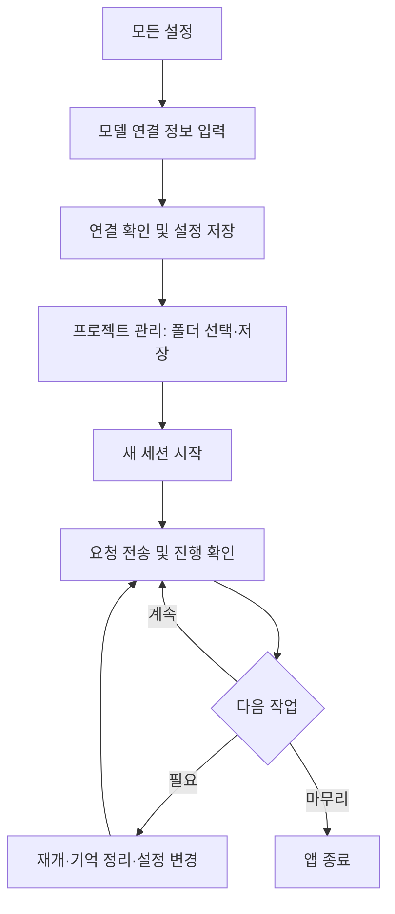

# MnemoArc 브라우저 UI 사용자 매뉴얼

이 문서는 처음 사용하는 사람이 브라우저 화면에서 설정, 프로젝트 등록, 작업, 종료까지 진행하는 순서를 안내합니다. 화면 동작과 문구는
`frontend/src`의 UI 소스를 기준으로 확인했습니다.

## 1. 처음 설정

1. 왼쪽 메뉴의 **모든 설정**을 누릅니다. 설정 화면은 처음에 **모델 연결** 분류를 엽니다.
   [App.jsx](../frontend/src/App.jsx#L299-L307),
   [Settings.jsx](../frontend/src/Settings.jsx#L211-L213)
2. **API 주소**에 OpenAI 호환 서버 주소를 `/v1`까지 입력하고, **모델 이름**에 서버의 정확한 모델 ID를 입력합니다. **모델 최대
   컨텍스트**도 설정합니다. 이 두 값 중 모델 이름이나 최대 컨텍스트가 없으면 채팅 요청을 실행할 수 없습니다.
   [fields.js](../frontend/src/fields.js#L10-L34),
   [App.jsx](../frontend/src/App.jsx#L196-L199)
3. 필요에 따라 **요청 컨텍스트 예산**, **요청 출력 한도**, **API 키 환경변수** 등을 입력합니다. 각 입력란 아래의 설명을 확인하세요.
   [fields.js](../frontend/src/fields.js#L20-L45),
   [Settings.jsx](../frontend/src/Settings.jsx#L421-L471)
4. API 키를 직접 입력하려면 **새 API 키** 칸을 사용합니다. 전체 기본 설정에서 **이 기기에 키 저장**을 선택하면 별도 설정 파일에 저장되며
   화면에 다시 표시되지 않습니다. 선택하지 않으면 직접 입력한 키는 앱 종료 시 폐기됩니다. 키를 입력하지 않을 때는 설정한 환경변수 또는 `.env`에서
   읽습니다. [Settings.jsx](../frontend/src/Settings.jsx#L374-L417),
   [fields.js](../frontend/src/fields.js#L20-L26)
5. **연결 확인**을 눌러 일반 응답, 스트리밍, 도구 왕복을 확인합니다. 성공하면 **연결 확인 완료 · 응답, 스트리밍, 도구 호출이 정상입니다.**가
   표시되고, 실패하면 화면에 오류가 표시됩니다. [Settings.jsx](../frontend/src/Settings.jsx#L276-L289),
   [Settings.jsx](../frontend/src/Settings.jsx#L483-L492)
6. **설정 저장**을 누릅니다. 저장 후에는 **설정을 저장했습니다.** 또는 적용 대기 안내가 나타납니다. 설정 화면의 **채팅으로 돌아가기**로 채팅
   화면에 돌아갑니다. [Settings.jsx](../frontend/src/Settings.jsx#L239-L274),
   [Settings.jsx](../frontend/src/Settings.jsx#L308-L316),
   [Settings.jsx](../frontend/src/Settings.jsx#L483-L492)

> **API 키 삭제:** **입력·저장한 키 지우기**를 선택하고 설정을 저장하면 앱에 등록한 키가 지워집니다. 환경변수의 키는 계속 사용할 수 있다는 안내가
  표시됩니다. [Settings.jsx](../frontend/src/Settings.jsx#L400-L417)

## 2. 프로젝트 관리와 새 세션 시작

1. 왼쪽 메뉴에서 **프로젝트 관리**를 누릅니다. 관리 화면의 **＋ 프로젝트 추가**로 새 항목을 만들거나, 왼쪽 프로젝트 목록에서 기존 항목을 선택해
   수정합니다. [App.jsx](../frontend/src/App.jsx#L284-L298),
   [App.jsx](../frontend/src/App.jsx#L574-L614)
2. **프로젝트 이름**과 **소스 폴더**를 입력합니다. **폴더 선택**을 누르면 **프로젝트 폴더 선택** 창이 열립니다. 폴더를 탐색한 뒤 **이 폴더
   선택**을 누릅니다. 상위 폴더로 이동하거나 창을 닫을 수도 있습니다.
   [Settings.jsx](../frontend/src/Settings.jsx#L23-L65),
   [Settings.jsx](../frontend/src/Settings.jsx#L66-L95)
3. **결과 문서 경로**에는 프로젝트 폴더 기준 상대 경로 또는 절대 경로를 입력합니다. 필요하면 **작업 목적**, **문서 독자**, 포함·제외 파일
   패턴도 지정합니다. [Settings.jsx](../frontend/src/Settings.jsx#L96-L135)
4. **프로젝트 저장**을 눌러 등록 또는 수정 내용을 저장합니다. 화면은 **프로젝트를 저장했습니다. 새 세션에 적용됩니다.**라고 안내합니다.
   [App.jsx](../frontend/src/App.jsx#L556-L567),
   [App.jsx](../frontend/src/App.jsx#L616-L643)
5. 선택한 프로젝트에서 바로 시작하려면 **이 프로젝트로 새 세션**을 누릅니다. 채팅 화면의 **새 세션**은 현재 세션의 프로젝트, 없으면 첫 등록
   프로젝트로 세션을 만듭니다. 사이드바의 프로젝트 이름을 눌러도 그 프로젝트로 새 세션이 생성됩니다.
   [App.jsx](../frontend/src/App.jsx#L630-L643),
   [App.jsx](../frontend/src/App.jsx#L219-L253)
6. 기존 세션으로 돌아가려면 사이드바에서 해당 세션을 선택합니다. 세션 항목에는 제목, 기억 개수, 상태가 표시됩니다.
   [App.jsx](../frontend/src/App.jsx#L254-L264),
   [App.jsx](../frontend/src/App.jsx#L506-L535)

## 3. 채팅과 작업 제어

1. 채팅 입력란 **메시지**에 요청을 적습니다. **Enter** 또는 **메시지 보내기**로 전송하고, **Shift+Enter**로 줄을 바꿉니다. 모델과
   컨텍스트 한도가 설정되지 않았다면 **연결 설정 열기 →**를 눌러 설정 화면으로 갑니다.
   [Chat.jsx](../frontend/src/Chat.jsx#L196-L240),
   [Chat.jsx](../frontend/src/Chat.jsx#L259-L272)
2. 요청 처리 방식을 바꾸려면 **작업 방식**을 선택합니다. 화면 안내에 따르면 변경은 다음 요청부터 적용됩니다. 작업 중에는 진행 문구, 경과 시간, 모델
   호출 횟수가 표시되며, 상단에는 세션 상태가 보입니다. [Chat.jsx](../frontend/src/Chat.jsx#L27-L45),
   [Chat.jsx](../frontend/src/Chat.jsx#L180-L187),
   [Chat.jsx](../frontend/src/Chat.jsx#L242-L258),
   [App.jsx](../frontend/src/App.jsx#L344-L348)
3. 실행 중인 작업을 멈추려면 입력란 옆 **■ 중지**를 누릅니다. 작업이 실행 중이 아닐 때는 보내기 버튼이 표시됩니다.
   [Chat.jsx](../frontend/src/Chat.jsx#L259-L272),
   [App.jsx](../frontend/src/App.jsx#L440-L454)
4. 세션 화면 위쪽의 **재개**는 보존된 상태로 작업을 다시 시작하고, **기억 정리**는 기억과 상태를 정리합니다. 다른 작업이 실행 중이거나 모델 설정이
   부족하면 이 버튼들이 비활성화됩니다. [App.jsx](../frontend/src/App.jsx#L404-L422)
5. **세션 닫기**를 누르면 확인 창이 나타납니다. 안내 문구는 **이 세션을 닫을까요? 대화와 기억은 사라지고 결과 문서는 유지됩니다.**입니다. 사이드바의
   세션 항목에도 닫기 버튼이 있습니다. [App.jsx](../frontend/src/App.jsx#L170-L178),
   [App.jsx](../frontend/src/App.jsx#L423-L431),
   [App.jsx](../frontend/src/App.jsx#L524-L535)

오른쪽 상세 패널은 상단의 **상세 패널 표시** 버튼으로 열고 닫습니다. 패널에는 다음 탭이 있습니다.
[App.jsx](../frontend/src/App.jsx#L344-L357), [App.jsx](../frontend/src/App.jsx#L776-L798)

| 탭 | 확인하거나 할 수 있는 일 | UI 근거 |
| --- | --- | --- |
| **기억** | 세션 기억을 검색하고 상세 내용과 출처, 사용량을 봅니다. | [App.jsx](../frontend/src/App.jsx#L800-L899) |
| **진행** | 할 일 목록, 실행 단계, 완료 조건 검증, 조사 목록을 봅니다. | [App.jsx](../frontend/src/App.jsx#L903-L1066) |
| **도구** | 선택 도구를 켜고 끕니다. 변경 사항은 다음 요청부터 적용됩니다. | [App.jsx](../frontend/src/App.jsx#L1068-L1095) |
| **문서** | **문서 불러오기**로 결과를 미리 보고 **Markdown 내려받기**로 저장합니다. | [App.jsx](../frontend/src/App.jsx#L1139-L1179) |
| **프로젝트** | 현재 세션에만 적용할 프로젝트 정보를 수정합니다. | [App.jsx](../frontend/src/App.jsx#L1182-L1206) |

## 4. 설정 적용 범위와 종료

**모든 설정** 화면의 **적용 범위**에서 **전체 기본 설정 · 파일에 저장**을 고르면 기본 설정을 저장합니다. 세션이 있을 때는 **현재 세션만 · 임시
적용**도 선택할 수 있습니다. 전체 기본 설정을 저장할 때 **현재 세션에도 적용**을 선택하면 현재 세션에도 설정을 보냅니다.
[Settings.jsx](../frontend/src/Settings.jsx#L239-L260),
[Settings.jsx](../frontend/src/Settings.jsx#L318-L341)

작업 중 설정 변경이 대기 상태가 되면 **설정 변경이 대기 중입니다. 현재 요청이 끝나거나 필요한 기억 정리가 완료되면 적용됩니다.**라는 안내가 표시됩니다.
적용 범위를 바꿀 때 저장하지 않은 변경이 있으면 버릴지 묻습니다. [App.jsx](../frontend/src/App.jsx#L434-L438),
[Settings.jsx](../frontend/src/Settings.jsx#L290-L299)

앱을 끝내려면 왼쪽 메뉴의 **앱 종료**를 누르고 확인 창에 응답합니다. 화면은 **탭을 닫아도 작업은 계속됩니다. 종료하려면 앱 종료를 누르세요.**라고
안내합니다. 종료 요청 뒤에는 **앱 종료를 요청했습니다**와 **진행 중인 작업을 정리한 뒤 종료합니다. 이 탭을 닫아도 됩니다.**가 표시됩니다.
[App.jsx](../frontend/src/App.jsx#L179-L205), [App.jsx](../frontend/src/App.jsx#L308-L313)

